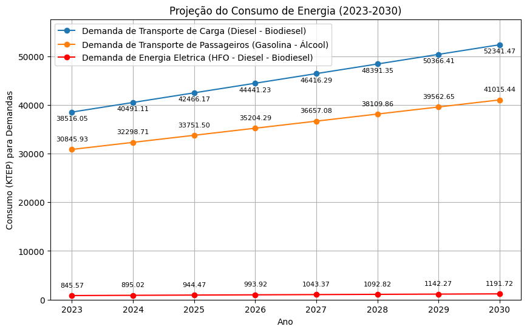

# Segunda Avaliação de Economia de Energia - Consumo e Projeção

**Disciplina**: FGA 0265 Economia de Energia, Turma 01/2024.1
**Docentes**: Augusto Cesar de Mendonça Brasil e Rudi Henri van Els

## Discentes
|Matrícula | Aluno | Curso |
| -- | -- | -- |
| 20/0061216  |  Cleber de Oliveira Brant | Eng. Software |
| 19/0042672  |  Gabriel Pereira Cortez | Eng. Energia |
| 20/0062450  |  Marina da Matta Nery | Eng. Energia |

## Sobre
Este estudo visa quantificar a energia necessária para atender a demanda de eletricidade e transporte de um País X, utilizando dados do Balanço Energético Nacional (BEN), além de projetar um cenário de eletrificação parcial do setor de transporte, e também projetar o consumo energético futuro baseado nos dados existentes.

**Linguagem**: Python 
**Bibliotecas necessárias**: matplotlib, numpy, scikit-learn

## Configuração do Ambiente
Para rodar o programa, é necessário configurar seu ambiente fazendo uma instalação prévia do Python 3. Recomenda-se a utilização do Visual Studio Code, e duas extensões dentro do mesmo, o Jupyter e o Python, que também precisam de instalação prévia. Após isso, é necessário instalar as bibliotecas em algum terminal de seu computador.

## Resultados
### Cenário Business as Usual

### Cenário Eletrificação

