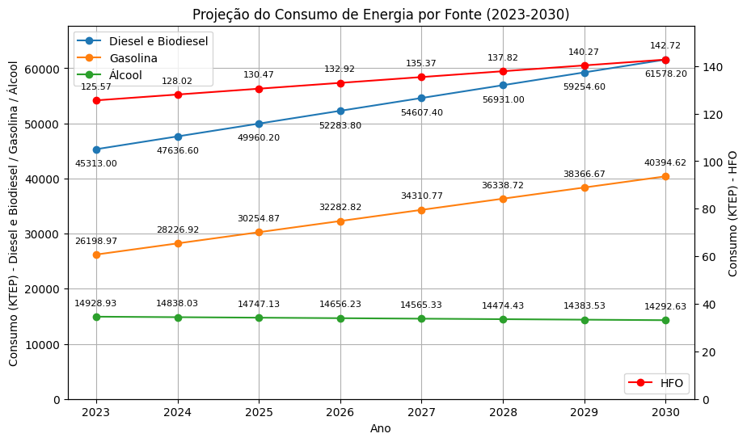

# Trabalho Economia de Energia - Consumo e Projeção

**Disciplina**: Economia de Energia 
**Docente**: Rudi Henri Van Els

## Alunos
|Matrícula | Aluno | Curso |
| -- | -- | -- |
| 20/0061216  |  Cleber de Oliveira Brant | Eng. Software |
| 19/0042672  |  Gabriel Pereira Cortez | Eng. Energia |
| 20/0062450  |  Marina da Matta Nery | Eng. Energia |

## Sobre
**Linguagem**: Python 
**Bibliotecas**: matplotlib, numpy, scikit-learn

O grupo decidiu fazer o programa em Python, e utilizamos a bibliotecas acima para fazer as projeções e plotar os graficos.

## Configuração de Ambiente
Para rodar o programa, é necessário configurar seu ambiente, com isso, é necessário a instalação previa do Python 3, e é recomendado a utilização do Visual Studio Code, dentro dele, tambem é recomendada a instalação de 2 plugins na IDE, que seriam o Jupyter e o Python. Após isso instale as bibliotecas com o PIP em algum terminal de seu computador.

pip install numpy 
pip install matplotlib 
pip install scikit-learn

## Screenshots
### Cenário Business as Usual

### Cenário Eletrificação

